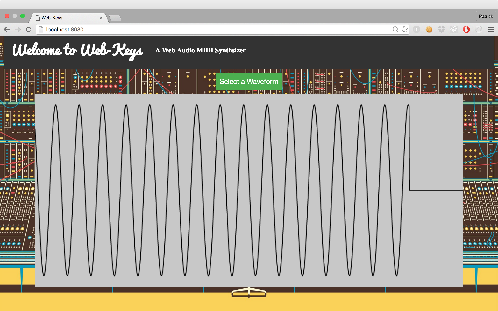

Web-Keys is a hand rolled midi synthesizer built by Patrick Hardy with the Web-Midi-Api and Web-Audio-Api. HTML5 canvas was also used to display AudioNode data in the form of an oscilloscope.

Simply plug in your midi keyboard, open the application in Google Chrome and jam away.

Check out a demo [here](https://www.youtube.com/watch?v=cMIRmDqgVWg)

Deployed [here](http://patrickwhardy.github.io/)



To run locally:
``` bash
git clone https://github.com/patrickwhardy/web-keys.git
cd web-keys
npm install
npm start
```
